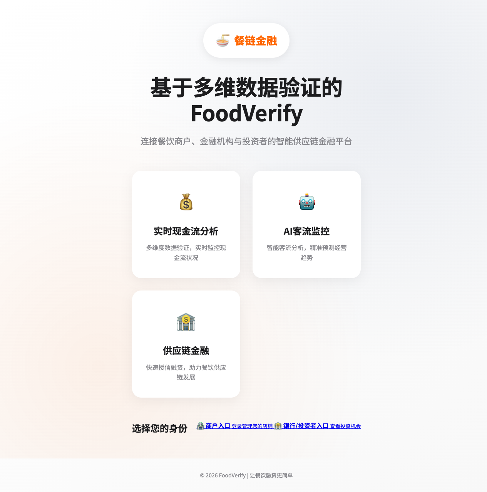
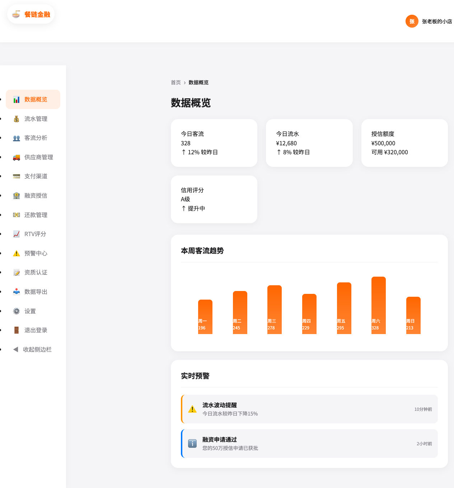

# 🍽️ 餐饮供应链金融赋能平台 (FoodVerify)

基于多维数据验证的餐饮供应链金融赋能平台 - 商用级风控与信贷评估系统。

[](LICENSE)
[](package.json)
[](https://jackywyj.github.io/restaurant-supply-chain-finance/)

## 👀 在线演示

🔗 **GitHub Pages**: https://jackywyj.github.io/restaurant-supply-chain-finance/

> 💡 直接在浏览器中体验完整功能！

## 📸 项目截图

| 登录页面 | 商户后台 |
|:--------:|:--------:|
|  |  |

## ✨ 功能特性

- 📊 **数据概览** - 实时客流、流水、授信额度监控
- 📹 **实时摄像头客流监测** - AI 视频实时客流统计与分析
- 💰 **流水管理** - 数字化资金往来记录
- 👥 **客流分析** - AI视频客流统计与分析
- 🚚 **供应商管理** - 供应链上下游协同
- 💳 **支付渠道** - 支付宝/微信支付接入
- 🏦 **融资授信** - 基于RTV评分的智能授信
- 💵 **还款管理** - 分期还款计划与提醒
- 📈 **RTV评分** - 多维数据信用评估模型
- ⚠️ **预警中心** - 风险预警与通知

## 📥 下载安装

### Windows 版本
- [餐饮供应链金融平台 Setup 1.2.0.exe](https://github.com/JACKYwyj/restaurant-supply-chain-finance/releases/tag/v1.2.0)

### macOS 版本
- [餐饮供应链金融平台-1.2.0-arm64.dmg](https://github.com/JACKYwyj/restaurant-supply-chain-finance/releases/tag/v1.2.0)

### 浏览器访问
直接打开 `frontend/index.html` 即可体验

---

## 🚀 快速开始

### 开发模式

```bash
# 克隆项目
git clone https://github.com/JACKYwyj/restaurant-supply-chain-finance.git
cd restaurant-supply-chain-finance

# 安装依赖
npm install

# 启动前端
# 直接打开 frontend/index.html

# 启动后端 (可选)
cd backend
pip install -r requirements.txt
python app.py
```

### 构建安装包

```bash
# Windows
npm run build:win

# macOS
npm run build:mac
```

---

## 📁 项目结构

```
├── backend/           # Flask 后端
│   ├── api/          # API 接口
│   ├── services/     # 业务服务
│   ├── models.py     # 数据模型
│   ├── utils/        # 工具函数
│   └── monitoring/   # 监控模块
├── frontend/         # Web 前端
│   ├── index.html    # 登录页
│   ├── dashboard.html # 商户后台
│   ├── bank.html     # 银行/投资者端
│   ├── css/          # 样式文件
│   └── js/           # JavaScript 文件
├── cv/               # 客流分析 CV 模块
│   └── 客流分析/     # 客流分析算法
├── electron/         # Electron 桌面应用
├── dist/             # 构建产物
└── screenshots/      # 项目截图
```

---

## 🛠 技术栈

| 层级 | 技术 |
|------|------|
| 后端 | Flask + SQLAlchemy + JWT |
| 前端 | HTML5 + CSS3 + JavaScript |
| CV | OpenCV + YOLO |
| 桌面 | Electron |
| 数据库 | SQLite (开发 (生产) |

) / MySQL---

## 📄 许可证

MIT License - 查看 [LICENSE](LICENSE) 文件

---

## 👤 作者

Jacky Wang - [GitHub](https://github.com/JACKYwyj)
